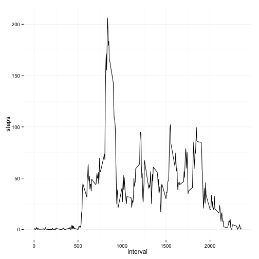
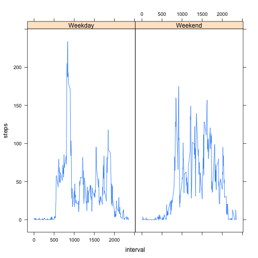
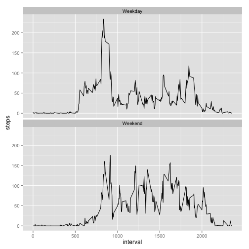

# Reproducible Research: Peer Assessment 1

## Loading and preprocessing the data
Delete intermediate files

```r
url <- "https://d396qusza40orc.cloudfront.net/repdata%2Fdata%2Factivity.zip"
zipfile <- "activity.zip"
download.file(url, method = "curl", destfile = zipfile)
unzip(zipfile)
activity <- read.csv("activity.csv")
file.remove("activity.csv")
```

```
## [1] TRUE
```

```r
str(activity)
```

```
## 'data.frame':	17568 obs. of  3 variables:
##  $ steps   : int  NA NA NA NA NA NA NA NA NA NA ...
##  $ date    : Factor w/ 61 levels "2012-10-01","2012-10-02",..: 1 1 1 1 1 1 1 1 1 1 ...
##  $ interval: int  0 5 10 15 20 25 30 35 40 45 ...
```


## What is mean total number of steps taken per day

```r
hist(activity$steps)
```

 

```r
summary(activity$steps)
```

```
##    Min. 1st Qu.  Median    Mean 3rd Qu.    Max.    NA's 
##     0.0     0.0     0.0    37.4    12.0   806.0    2304
```


## What is the average daily activity pattern?

```r
library(ggplot2)
ggplot(activity, aes(interval, steps)) + geom_line(stat = "summary", fun.y = "mean") + 
    theme_minimal()
```

```
## Warning: Removed 2304 rows containing missing values (stat_summary).
```

 

```r

library(dplyr)
```

```
## 
## Attaching package: 'dplyr'
## 
## The following objects are masked from 'package:stats':
## 
##     filter, lag
## 
## The following objects are masked from 'package:base':
## 
##     intersect, setdiff, setequal, union
```

```r

steps.mean <- activity %.% select(interval, steps) %.% group_by(interval) %.% 
    summarise(meansteps = mean(steps, na.rm = TRUE))

with(steps.mean, plot(interval, meansteps, type = "l"))
```

 


Which interval

```r
with(steps.mean, interval[which(max(meansteps) == meansteps)])
```

```
## [1] 835
```

which (pun intended) matches with the chart

## Imputing missing values
complete.cases counts number of rows without any NA
the number of rows - complete.cases gives us the number of incomplete rows

Use the mean step per date/

```r
nrow(activity) - sum(complete.cases(activity))
```

```
## [1] 2304
```

```r
library(Hmisc)
```

```
## Loading required package: grid
## Loading required package: lattice
## Loading required package: survival
## Loading required package: splines
## Loading required package: Formula
## 
## Attaching package: 'Hmisc'
## 
## The following objects are masked from 'package:dplyr':
## 
##     src, summarize
## 
## The following objects are masked from 'package:base':
## 
##     format.pval, round.POSIXt, trunc.POSIXt, units
```


Impute the activity dataset with the means steps per interval (allready calculated)
merge the activity dataframe with the means per interval

```r
temp <- merge(activity, steps.mean)
temp[is.na(temp$steps), "steps"] <- temp$meansteps[is.na(temp$steps)]
```


Create plots comparing original data with imputed data. Imputed data have as expected as higher
number of steps.

```r
par(mfrow = c(2, 1), mar = c(4, 4, 1, 1))
hist(activity$steps)
hist(temp$steps)
```

 


## Are there differences in activity patterns between weekdays and weekends?

```r
library(lubridate)
activity$date <- as.Date(activity$date)
activity$weekdayorweekend <- ifelse(wday(activity$date) %in% c(1, 7), "Weekend", 
    "Weekday")

activity.daytype <- activity %.% group_by(interval, weekdayorweekend) %.% summarise(steps = mean(steps, 
    na.rm = TRUE))


xyplot(steps ~ interval | weekdayorweekend, activity.daytype, type = "l")
```

 

```r
ggplot(activity.daytype, aes(interval, steps)) + geom_line() + facet_wrap(~weekdayorweekend, 
    ncol = 1)
```

 


